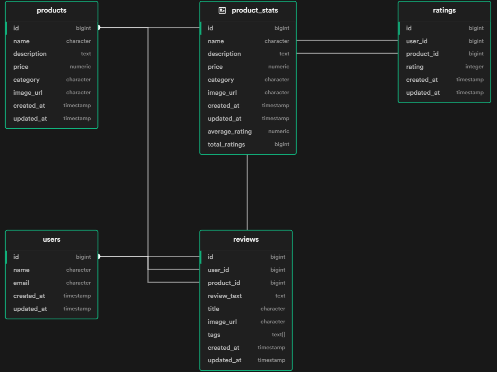

# Product Reviews Assignment for Fitpage

## Database Schema

The application uses the following database schema:



### Tables:
- **users** - Store user information (id, name, email)
- **products** - Store product details (id, name, description, price, category, image_url)
- **reviews** - Store user reviews (id, user_id, product_id, review_text, title, image_url, tags)
- **ratings** - Store product ratings (id, user_id, product_id, rating)

## Setup

### Prerequisites
- Node.js (version 14.x or higher)
- npm
- Supabase account
- Cloudinary account (for image uploads)

***Note**: This application uses **Supabase instead of a traditional PostgreSQL database**. As we needed to host it on a platform, an online database service like Supabase is preferred. Although **Supabase supports PostgreSQL, it provides a more convenient setup for web applications**.*

### Installation
1. Install dependencies:
```bash
npm install
```

2. Create Supabase project and get your URL and anon key from Settings > API

3. Create Cloudinary account and get your credentials:
   - Go to [Cloudinary](https://cloudinary.com) and create an account
   - Get your Cloud Name, API Key, and API Secret from the dashboard

4. Set up database schema:
   - Go to Supabase SQL Editor
   - Run the contents of `src/utils/db.sql` file

5. Create `.env` file:
```env
PORT=3000
SUPABASE_URL=your_supabase_project_url
SUPABASE_ANON_KEY=your_supabase_anon_key
CLOUDINARY_CLOUD_NAME=your_cloudinary_cloud_name
CLOUDINARY_API_KEY=your_cloudinary_api_key
CLOUDINARY_API_SECRET=your_cloudinary_api_secret
```

## Running the Application

```bash
npm run dev
```

Application will be available at: `http://localhost:3000`

## Testing

### Health Check
```bash
curl -X GET "http://localhost:3000/api/health"
```

### Web Interface Testing
1. Navigate to `http://localhost:3000`
2. Set up a user (name and email)
3. View products
4. Rate a product (1-5 stars)
5. Add review text and title and images
6. View reviews for products

## Author Information

<table>
  <tr>
    <td><strong>Name:</strong></td>
    <td>Nayan Mandal</td>
  </tr>
  <tr>
    <td><strong>Program:</strong></td>
    <td colspan="3">B.Tech - Computer Science Engineering (Minor in Data Science and Analytics)</td>
  </tr>
  <tr>
    <td><strong>Institute:</strong></td>
    <td colspan="3">Indian Institute Of Information Technology, Nagpur</td>
  </tr>
  <tr>
    <td><strong>Email (Institute):</strong></td>
    <td><a href="mailto:bt22csd035@iiitn.ac.in">bt22csd035@iiitn.ac.in</a></td>
    <td><strong>Email (Personal):</strong></td>
    <td><a href="mailto:nayan.iiitn@gmail.com">nayan.iiitn@gmail.com</a></td>
  </tr>
  <tr>
    <td><strong>GitHub:</strong></td>
    <td><a href="https://github.com/9keystrokes">github.com/9keystrokes</a></td>
    <td><strong>LinkedIn:</strong></td>
    <td><a href="https://linkedin.com/in/9keystrokes">linkedin.com/in/9keystrokes</a></td>
  </tr>
</table>
